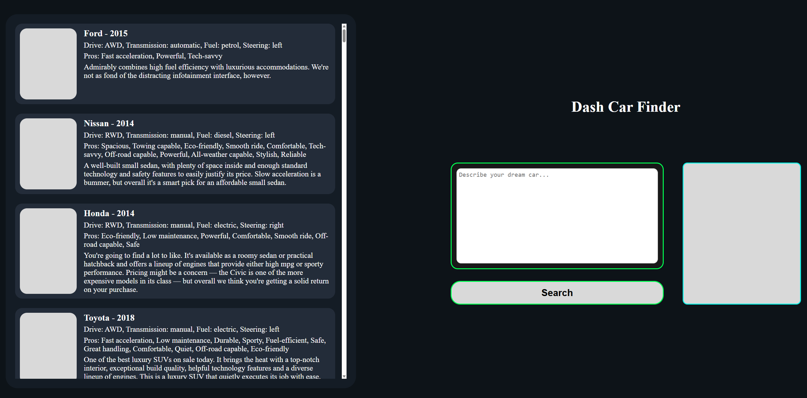
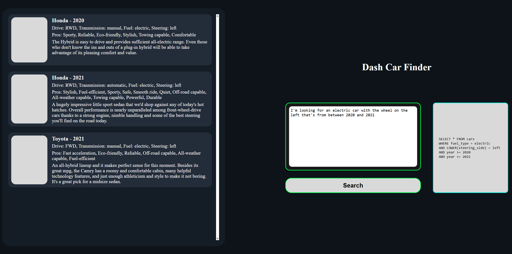

# Car Recommendation System

A natural language car recommendation system made with Dash, PostgreSQL and NLTK. The user can describe their perfect car in free text and the app extracts features (e.g. transmission, fuel, year) to generate dynamic SQL queries and display matched results.

---

